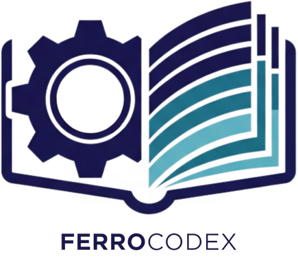

# Ferrocodex

<div align="center">



🏗️ **Secure OT Configuration Management Platform**

[](https://github.com/HillviewCap/ferrocodex/releases)
[](LICENSE)
[](https://github.com/HillviewCap/ferrocodex/actions)

A cross-platform desktop application for secure offline-first configuration management in operational technology (OT) environments.

</div>

## 🚀 Overview

Ferrocodex is a secure configuration management platform designed specifically for industrial equipment and operational technology environments. Built with Tauri 2.0, it combines the power of Rust's security and performance with React's modern UI capabilities to deliver an offline-first solution for managing critical infrastructure configurations.

### Key Features

- 🔒 **Enterprise-grade Security**: Role-based access control, session management, and audit trails
- 💾 **Offline-First Architecture**: Full functionality without internet connectivity
- 🔐 **Data Protection**: AES-256 encryption for all stored configurations (coming in v2.0)
- 🌐 **Cross-Platform**: Native desktop apps for Windows, macOS, and Linux
- 🎯 **OT-Focused**: Designed for industrial control systems and equipment
- 📝 **Comprehensive Audit Trail**: Track all configuration changes and access
- 🌳 **Version Control**: Built-in branching and versioning for configurations
- 👥 **Multi-User Support**: Administrator and Engineer role separation

## 📋 Prerequisites

- **Node.js**: 18+ 
- **Rust**: 1.78.0+
- **Platform-specific dependencies**:
  - **Linux**: `libwebkit2gtk-4.1-dev`, `build-essential`, `curl`, `wget`, `file`, `libgtk-3-dev`, `librsvg2-dev`
  - **macOS**: Xcode Command Line Tools
  - **Windows**: Microsoft Visual Studio C++ Build Tools

## 🛠️ Installation

### From Source

1. **Clone the repository**:
   ```bash
   git clone https://github.com/ferrocodex/ferrocodex.git
   cd ferrocodex
   ```

2. **Install dependencies**:
   ```bash
   npm install
   ```

3. **Install platform dependencies** (Linux example):
   ```bash
   sudo apt update
   sudo apt install libwebkit2gtk-4.1-dev build-essential curl wget file libgtk-3-dev librsvg2-dev
   ```

### Pre-built Binaries

Download the latest release for your platform from the [releases page](https://github.com/ferrocodex/ferrocodex/releases).

## 💻 Development

### Running in Development Mode

```bash
# Start the development server (both frontend and backend)
npm run dev

# Or from the desktop app directory
cd apps/desktop
npm run tauri:dev
```

The application will start with hot reload enabled for both the React frontend and Rust backend.

### Building for Production

```bash
# Build all packages
npm run build

# Build platform-specific binary
cd apps/desktop
npm run tauri:build
```

### Testing

```bash
# Run all tests
npm run test

# Frontend tests with coverage
cd apps/desktop
npm run test:coverage

# Backend tests
cargo test --manifest-path apps/desktop/src-tauri/Cargo.toml
```

## 📁 Project Structure

```
ferrocodex/
├── apps/
│   └── desktop/              # Main Tauri application
│       ├── src/              # React frontend
│       │   ├── components/   # UI components
│       │   ├── store/        # Zustand state management
│       │   ├── types/        # TypeScript types
│       │   └── utils/        # Utility functions
│       ├── src-tauri/        # Rust backend
│       │   └── src/
│       │       ├── assets/        # Equipment management
│       │       ├── audit/         # Audit logging
│       │       ├── auth/          # Authentication
│       │       ├── branches/      # Configuration branching
│       │       ├── configurations/# Config file management
│       │       ├── database/      # SQLite layer
│       │       ├── encryption/    # AES-256 encryption
│       │       ├── users/         # User management
│       │       └── validation/    # Input validation
│       └── package.json      
├── packages/
│   └── shared-types/         # Shared TypeScript types
├── .github/
│   └── workflows/           # GitHub Actions
├── CLAUDE.md                # AI assistant instructions
├── SECURITY.md              # Security policy
└── package.json             # Workspace configuration
```

## 🔧 Configuration

Ferrocodex stores its data in platform-specific locations:

- **Windows**: `%APPDATA%/com.ferrocodex.app/`
- **macOS**: `~/Library/Application Support/com.ferrocodex.app/`
- **Linux**: `~/.config/com.ferrocodex.app/`

The SQLite database is automatically initialized on first run with:
- WAL mode for better concurrency
- Optimized pragma settings
- Automatic schema migrations

## 🤝 Contributing

We welcome contributions! Please see our [Contributing Guide](CONTRIBUTING.md) for details.

1. Fork the repository
2. Create your feature branch (`git checkout -b feature/amazing-feature`)
3. Commit your changes (`git commit -m 'Add some amazing feature'`)
4. Push to the branch (`git push origin feature/amazing-feature`)
5. Open a Pull Request

### Development Guidelines

- Follow the existing code style
- Add tests for new functionality
- Update documentation as needed
- Ensure all tests pass before submitting

## 🔒 Security

Security is paramount for OT environments. Please report vulnerabilities responsibly:

- **DO NOT** open public issues for security vulnerabilities
- Email security@ferrocodex.com with details
- See [SECURITY.md](SECURITY.md) for more information

## 📜 License

This project is licensed under the GNU Affero General Public License v3.0 - see the [LICENSE](LICENSE) file for details.

This means that any modifications or derivative works must also be released under the AGPL-3.0 license, and if you run a modified version on a server, you must offer the source code to users of that server.

## 🙏 Acknowledgments

Built with:
- [Tauri](https://tauri.app/) - Build smaller, faster, and more secure desktop applications
- [React](https://reactjs.org/) - A JavaScript library for building user interfaces
- [Ant Design](https://ant.design/) - Enterprise-class UI design language
- [Rust](https://www.rust-lang.org/) - Performance, reliability, and productivity

## 📞 Support

- 📖 [Documentation](https://docs.ferrocodex.com) (coming soon)
- 🐛 [Issue Tracker](https://github.com/ferrocodex/ferrocodex/issues)
- 💬 [Discussions](https://github.com/ferrocodex/ferrocodex/discussions)

---

<div align="center">
Made with ❤️ for the OT community
</div>
