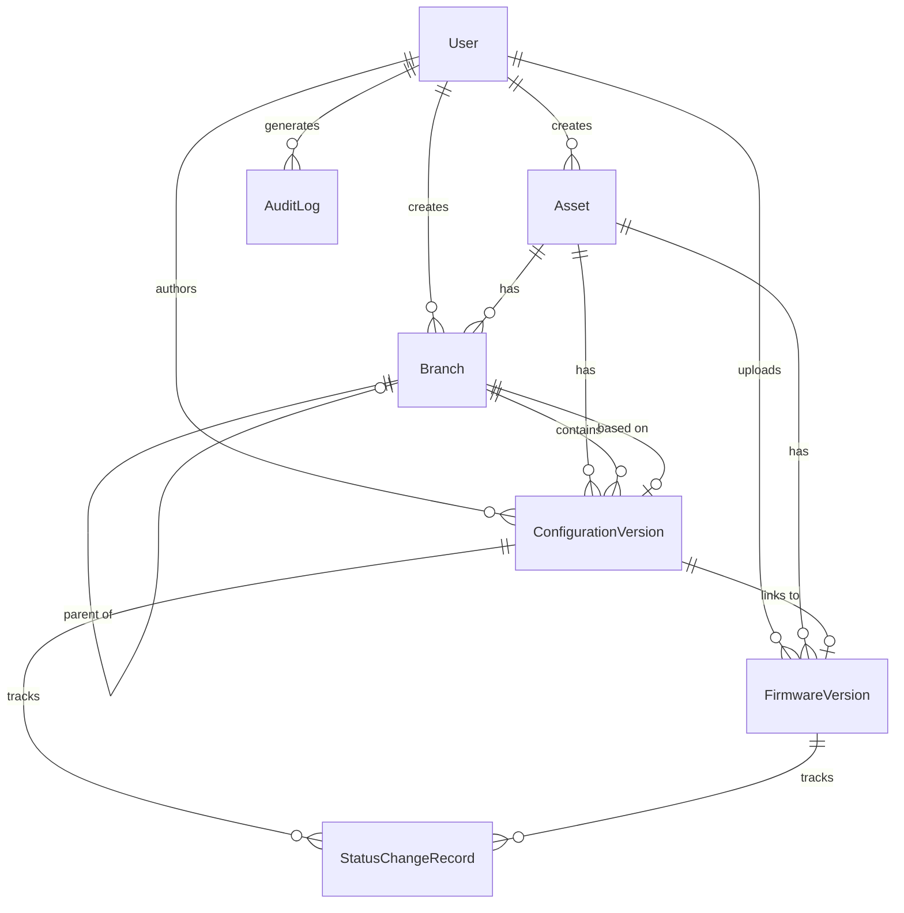

# Data Models

This document provides detailed definitions for all data models in the FerroCodex system, including their purposes, attributes, relationships, and TypeScript interfaces.

## Overview

FerroCodex uses a relational data model centered around **Assets** (equipment), **Configuration Versions**, **Firmware**, and **Users**. The system maintains complete audit trails and version history for all changes.

## Core Entities

### 1. User

**Purpose**: Represents system users with role-based access control.

**Attributes**:

- `id` (number): Unique identifier
- `username` (string): Unique username (3-50 chars, alphanumeric + underscore/hyphen)
- `password_hash` (string): Bcrypt hashed password
- `role` (Role): User role - Administrator or Engineer
- `is_active` (boolean): Account status
- `created_at` (string): ISO 8601 timestamp
- `last_login` (string?): Last successful login timestamp

**TypeScript Interface**:

```typescript
interface UserInfo {
  id: number;
  username: string;
  role: 'Administrator' | 'Engineer';
  is_active: boolean;
  created_at: string;
  last_login?: string;
}

type Role = 'Administrator' | 'Engineer';
```

**Business Rules**:

- Usernames must be unique
- At least one active Administrator must exist
- Passwords must be minimum 8 characters
- Failed login attempts are tracked for security

### 2. Asset

**Purpose**: Represents a piece of equipment or device being managed.

**Attributes**:

- `id` (number): Unique identifier
- `name` (string): Unique asset name (1-100 chars)
- `description` (string): Asset description (0-500 chars)
- `created_by` (number): User ID of creator
- `created_at` (string): ISO 8601 timestamp

**TypeScript Interface**:

```typescript
interface Asset {
  id: number;
  name: string;
  description: string;
  created_by: number;
  created_at: string;
}

interface AssetInfo extends Asset {
  created_by_username: string;
  configuration_count: number;
  branch_count: number;
  golden_version?: ConfigurationVersionInfo;
  latest_version?: ConfigurationVersionInfo;
}
```

**Relationships**:

- Has many Configuration Versions
- Has many Branches
- Has many Firmware Versions
- Created by one User

### 3. Configuration Version

**Purpose**: Represents a specific version of an asset's configuration file.

**Attributes**:

- `id` (number): Unique identifier
- `asset_id` (number): Parent asset ID
- `version_number` (number): Auto-incrementing version
- `file_name` (string): Original filename
- `file_size` (number): File size in bytes
- `file_hash` (string): SHA-256 hash
- `file_content` (Uint8Array): Encrypted file content
- `notes` (string): Version notes (0-1000 chars)
- `status` (ConfigurationStatus): Version status
- `author_id` (number): User ID of creator
- `created_at` (string): ISO 8601 timestamp
- `branch_id` (number?): Associated branch ID
- `firmware_version_id` (number?): Linked firmware ID

**TypeScript Interface**:

```typescript
interface ConfigurationVersion {
  id: number;
  asset_id: number;
  version_number: number;
  file_name: string;
  file_size: number;
  file_hash: string;
  file_content: Uint8Array;
  notes: string;
  status: ConfigurationStatus;
  author_id: number;
  created_at: string;
  branch_id?: number;
  firmware_version_id?: number;
}

interface ConfigurationVersionInfo {
  id: number;
  asset_id: number;
  version_number: number;
  file_name: string;
  file_size: number;
  file_hash: string;
  notes: string;
  status: ConfigurationStatus;
  author_id: number;
  author_username: string;
  created_at: string;
  branch_id?: number;
  branch_name?: string;
  firmware_version_id?: number;
  status_history?: StatusChangeRecord[];
}

type ConfigurationStatus = 'Draft' | 'Silver' | 'Approved' | 'Golden' | 'Archived';
```

**Business Rules**:

- Version numbers auto-increment per asset
- Only one Golden version per asset
- Status transitions follow defined workflow
- File content is always encrypted at rest

### 4. Branch

**Purpose**: Enables isolated configuration development and testing.

**Attributes**:

- `id` (number): Unique identifier  
- `name` (string): Branch name (1-100 chars)
- `description` (string?): Optional description (0-500 chars)
- `asset_id` (number): Parent asset ID
- `parent_branch_id` (number?): Parent branch for sub-branches
- `base_version_id` (number?): Starting configuration version
- `created_by` (number): User ID of creator
- `created_at` (string): ISO 8601 timestamp
- `is_active` (boolean): Branch status

**TypeScript Interface**:

```typescript
interface Branch {
  id: number;
  name: string;
  description?: string;
  asset_id: number;
  parent_branch_id?: number;
  base_version_id?: number;
  created_by: number;
  created_at: string;
  is_active: boolean;
}

interface BranchInfo extends Branch {
  created_by_username: string;
  parent_branch_name?: string;
  base_version?: ConfigurationVersionInfo;
  version_count: number;
  latest_version?: ConfigurationVersionInfo;
}
```

**Relationships**:

- Belongs to one Asset
- May have a parent Branch (for sub-branching)
- May start from a base Configuration Version
- Has many Configuration Versions
- Created by one User

### 5. Firmware Version

**Purpose**: Manages firmware files associated with assets for complete recovery scenarios.

**Attributes**:

- `id` (number): Unique identifier
- `asset_id` (number?): Optional associated asset
- `file_name` (string): Original filename
- `file_size` (number): File size in bytes
- `file_hash` (string): SHA-256 hash
- `file_path` (string): Encrypted file storage path
- `firmware_version` (string?): Detected/provided version
- `vendor` (string?): Device vendor
- `model` (string?): Device model
- `device_type` (string?): Type of device
- `notes` (string?): User notes (0-1000 chars)
- `status` (FirmwareStatus): Firmware status
- `author_id` (number): User ID of uploader
- `created_at` (string): ISO 8601 timestamp
- `analysis_status` (AnalysisStatus): Analysis state
- `analysis_result` (object?): Analysis findings

**TypeScript Interface**:

```typescript
interface FirmwareVersion {
  id: number;
  asset_id?: number;
  file_name: string;
  file_size: number;
  file_hash: string;
  file_path: string;
  firmware_version?: string;
  vendor?: string;
  model?: string;
  device_type?: string;
  notes?: string;
  status: FirmwareStatus;
  author_id: number;
  created_at: string;
  analysis_status: AnalysisStatus;
  analysis_result?: FirmwareAnalysisResult;
}

interface FirmwareVersionInfo extends FirmwareVersion {
  author_username: string;
  asset_name?: string;
  linked_configuration_count: number;
  status_history?: FirmwareStatusHistory[];
}

type FirmwareStatus = 'Draft' | 'Approved' | 'Golden' | 'Archived';
type AnalysisStatus = 'pending' | 'in_progress' | 'completed' | 'failed';
```

**Business Rules**:

- Large files stored encrypted on filesystem
- Metadata stored in database
- Automatic analysis queued on upload
- Status workflow similar to configurations

### 6. Audit Log

**Purpose**: Maintains complete audit trail of all system operations.

**Attributes**:

- `id` (number): Unique identifier
- `user_id` (number?): User who performed action
- `username` (string): Username at time of action
- `action` (string): Action performed
- `entity_type` (string): Type of entity affected
- `entity_id` (number?): ID of affected entity
- `details` (object?): Additional action details
- `ip_address` (string?): Client IP address
- `timestamp` (string): ISO 8601 timestamp

**TypeScript Interface**:

```typescript
interface AuditLogEntry {
  id: number;
  user_id?: number;
  username: string;
  action: string;
  entity_type: string;
  entity_id?: number;
  details?: Record<string, any>;
  ip_address?: string;
  timestamp: string;
}
```

## Supporting Types

### Status Change Record

Tracks all status transitions for configurations and firmware.

```typescript
interface StatusChangeRecord {
  id: number;
  entity_type: 'configuration' | 'firmware';
  entity_id: number;
  old_status: string;
  new_status: string;
  changed_by: number;
  changed_by_username: string;
  change_reason?: string;
  changed_at: string;
}
```

### File Metadata

Common file information structure.

```typescript
interface FileMetadata {
  name: string;
  size: number;
  type: string;
  lastModified: number;
  hash?: string;
}
```

### Dashboard Statistics

Aggregated statistics for dashboard display.

```typescript
interface DashboardStats {
  total_assets: number;
  total_configurations: number;
  total_users: number;
  total_firmware: number;
  recent_activity: AuditLogEntry[];
  encryption_type: string;
}
```

### Recovery Export

Structures for complete asset recovery exports.

```typescript
interface RecoveryManifest {
  export_id: string;
  export_date: string;
  exported_by: string;
  asset_name: string;
  configuration: ConfigurationExportInfo;
  firmware: FirmwareExportInfo[];
  checksums: Record<string, string>;
}

interface ConfigurationExportInfo {
  version_id: number;
  version_number: number;
  file_name: string;
  status: ConfigurationStatus;
  notes: string;
  author: string;
  created_at: string;
}

interface FirmwareExportInfo {
  firmware_id: number;
  file_name: string;
  version: string;
  vendor?: string;
  model?: string;
  status: FirmwareStatus;
}
```

## Validation Rules

### Username Validation

```typescript
const USERNAME_VALIDATION = {
  MIN_LENGTH: 3,
  MAX_LENGTH: 50,
  PATTERN: /^[a-zA-Z0-9_-]+$/,
  PATTERN_DESC: 'alphanumeric characters, underscores, and hyphens'
};
```

### Password Validation

```typescript
const PASSWORD_VALIDATION = {
  MIN_LENGTH: 8,
  PATTERN_DESC: 'minimum 8 characters'
};
```

### Asset Name Validation

```typescript
const ASSET_NAME_VALIDATION = {
  MIN_LENGTH: 1,
  MAX_LENGTH: 100,
  PATTERN_DESC: 'between 1 and 100 characters'
};
```

### File Size Limits

```typescript
const FILE_SIZE_LIMITS = {
  CONFIGURATION: 50 * 1024 * 1024,  // 50 MB
  FIRMWARE: 2 * 1024 * 1024 * 1024, // 2 GB
};
```

### Allowed File Extensions

```typescript
const ALLOWED_EXTENSIONS = {
  CONFIGURATION: ['.conf', '.cfg', '.txt', '.xml', '.json', '.ini', '.yaml', '.yml'],
  FIRMWARE: ['.bin', '.img', '.rom', '.fw', '.hex', '.elf', '.tar', '.gz', '.zip']
};
```

## Data Relationships Diagram



## Data Integrity Rules

1. **Referential Integrity**
   - Foreign keys enforce relationships
   - Cascade delete for related records where appropriate
   - Restrict delete for critical relationships

2. **Business Logic Integrity**
   - Only one Golden status per asset
   - Version numbers sequential per asset
   - Status transitions follow defined workflow
   - At least one active Administrator

3. **Security Integrity**
   - All file content encrypted at rest
   - Passwords hashed with bcrypt
   - Session tokens cryptographically secure
   - Audit trail immutable

4. **Temporal Integrity**
   - Timestamps in ISO 8601 format
   - Created dates immutable
   - Version history preserved

This data model provides a robust foundation for secure configuration and firmware management while maintaining complete audit trails and supporting complex versioning workflows.
