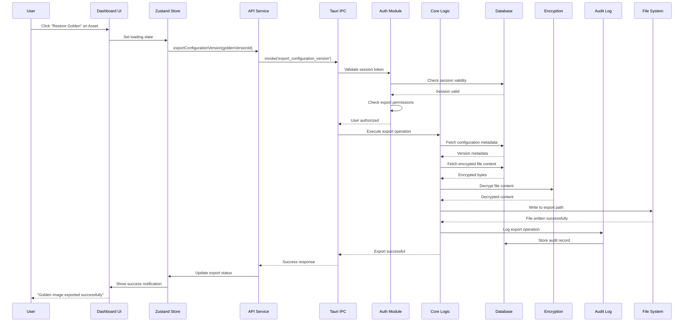
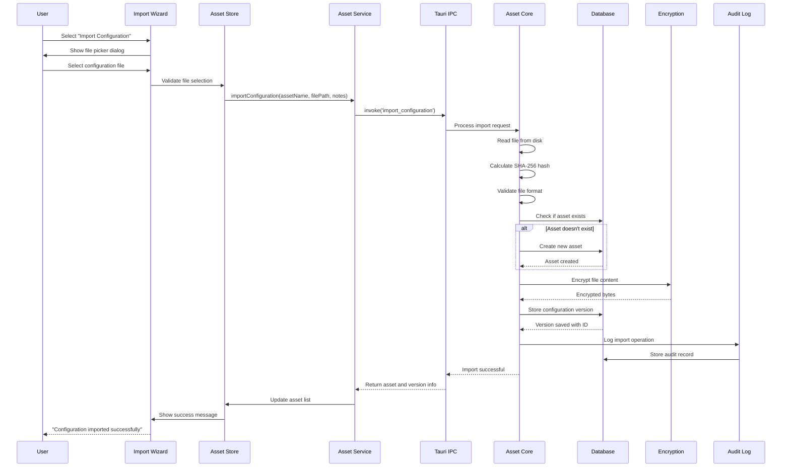
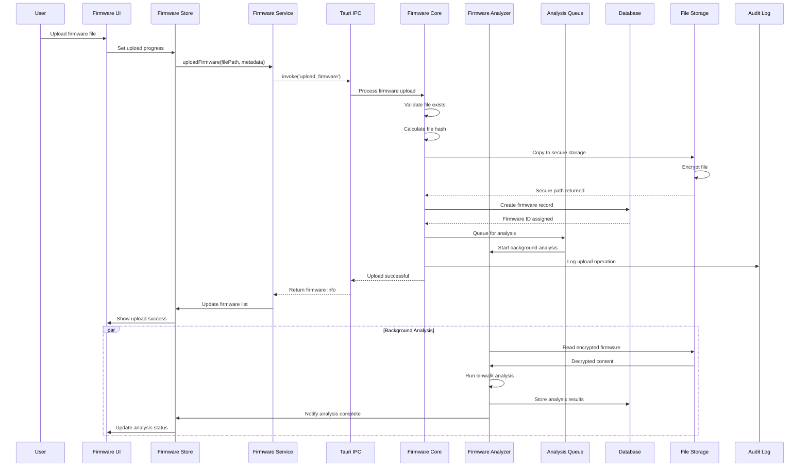
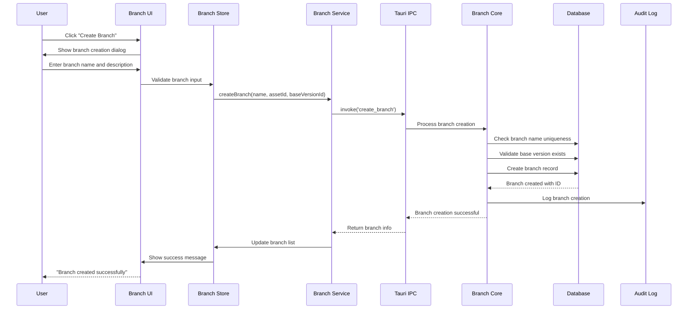
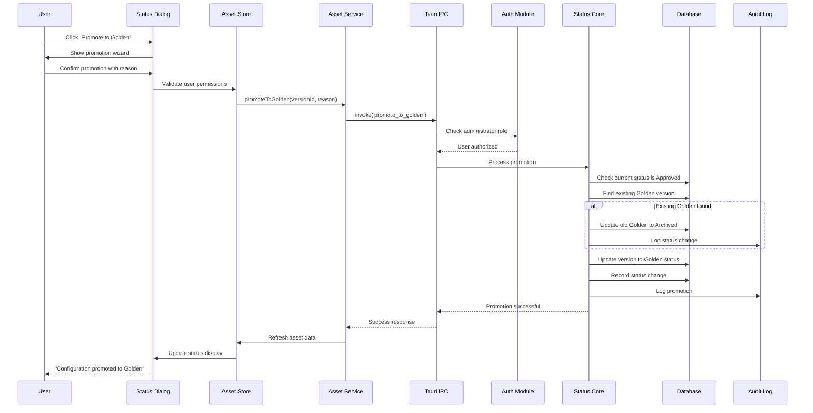
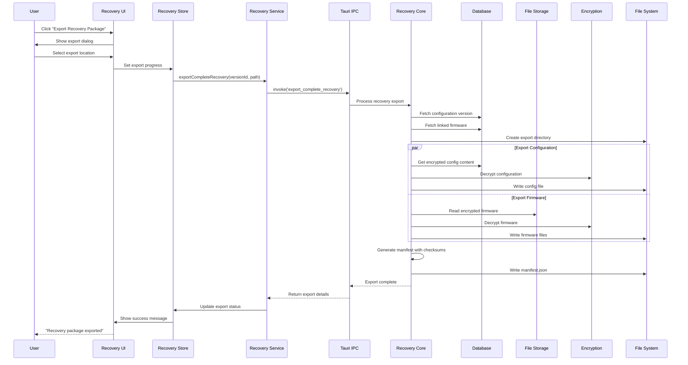

# Core Workflows

This document illustrates the key workflows in FerroCodex, showing how internal components interact to complete critical tasks. These workflows demonstrate the end-to-end processes that users rely on for configuration and firmware management.

## 1. Restore Golden Image Workflow

The "Restore Golden Image" workflow is the core recovery operation in FerroCodex, allowing engineers to quickly restore equipment to a known-good configuration.

## 2. Import Configuration Workflow

This workflow shows how new configuration files are imported and versioned in the system.

## 3. Firmware Upload and Analysis Workflow (v0.3.0)

This workflow demonstrates the Epic 3 firmware management capability.

## 4. Branch Creation and Version Management Workflow

This workflow shows how engineers create branches for isolated development.

## 5. Status Promotion Workflow

This workflow illustrates how configurations are promoted through status levels to Golden.

## 6. Complete Recovery Export Workflow (v0.3.0)

This Epic 3 workflow shows how firmware and configuration are exported together.

## Workflow Security Considerations

All workflows implement these security measures:

1. **Authentication**: Every workflow validates session tokens
2. **Authorization**: Role-based permissions checked before operations
3. **Audit Trail**: All operations logged with user context
4. **Encryption**: File content encrypted at rest and in transit
5. **Validation**: Input validation at multiple layers
6. **Rate Limiting**: Prevents abuse of system resources

## Error Handling Patterns

Each workflow implements consistent error handling:

- **Validation Errors**: Caught early and returned to user
- **Permission Errors**: Clear messaging about insufficient access
- **System Errors**: Graceful degradation with retry options
- **Rollback**: Atomic operations that can be safely reverted

These workflows form the backbone of FerroCodex operations, ensuring reliable and secure management of critical industrial configuration and firmware assets.