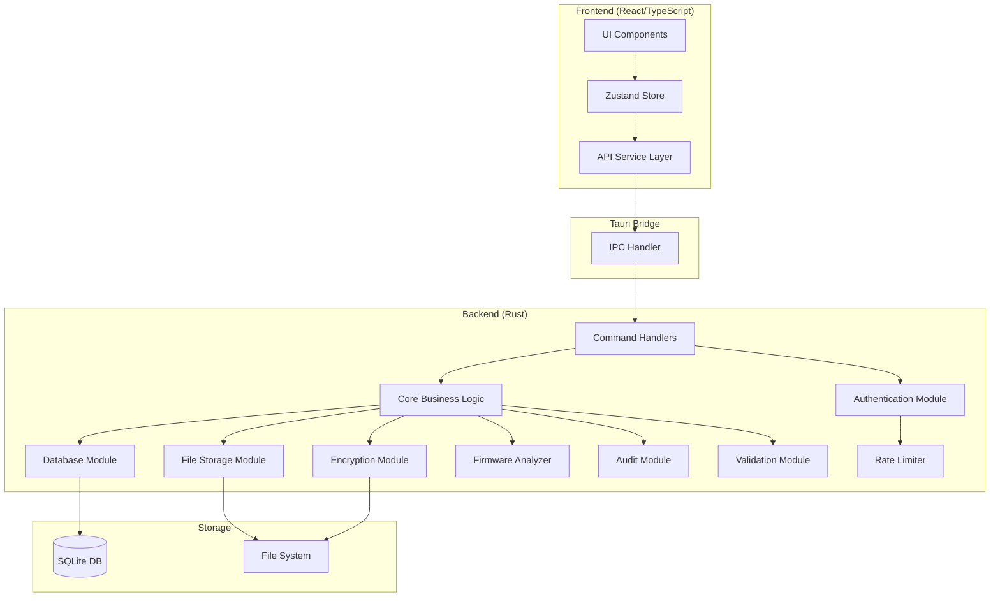
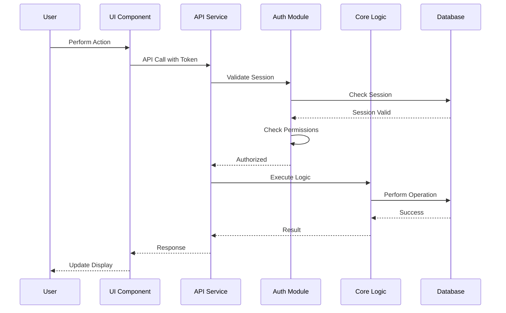

# Components

This document details the logical components of the FerroCodex application, their responsibilities, dependencies, and interactions.

## Component Architecture Overview

FerroCodex follows a clean architecture pattern with clear separation between the UI layer (React), the application core (Rust), and infrastructure concerns. The components communicate through well-defined interfaces using Tauri's IPC mechanism.

## Frontend Components

### 1. UI Components (React)

**Location**: `apps/desktop/src/components/`

**Responsibility**: Render the user interface and handle user interactions.

**Key Components**:

- `Dashboard`: Main application dashboard showing assets and statistics
- `AssetDetails`: Detailed view of an asset with versions and branches
- `ConfigurationHistory`: Timeline view of configuration versions
- `BranchManagement`: Branch creation and management interface
- `UserManagement`: Admin interface for user management
- `FirmwareManagement`: Firmware upload and analysis interface
- `StatusWorkflow`: Configuration/firmware status management
- `ImportWizard`: Guided configuration import process
- `ExportDialog`: Export configuration/firmware dialog
- `LoginForm`: Authentication interface
- `CreateAdminForm`: Initial admin setup

**Design Patterns**:

- Functional components with hooks
- Component composition for reusability
- Controlled components for forms
- Error boundaries for graceful error handling

### 2. State Management (Zustand)

**Location**: `apps/desktop/src/store/`

**Responsibility**: Manage application state and provide a clean API for components.

**Stores**:

- `authStore`: Authentication state and session management
- `assetStore`: Asset and configuration data management
- `branchStore`: Branch-related state
- `firmwareStore`: Firmware management state
- `uiStore`: UI preferences and temporary state

**Features**:

- Persistent state for user preferences
- Optimistic updates with rollback
- Computed values and selectors
- DevTools integration

### 3. API Service Layer

**Location**: `apps/desktop/src/services/`

**Responsibility**: Abstract Tauri IPC calls and handle request/response transformation.

**Services**:

- `authService`: Authentication and session operations
- `assetService`: Asset and configuration CRUD operations
- `branchService`: Branch management operations
- `firmwareService`: Firmware upload and management
- `exportService`: Export operations
- `validationService`: Client-side validation helpers

**Features**:

- Type-safe API calls
- Error transformation and handling
- Request/response logging in development
- Retry logic for transient failures

## Backend Components

### 4. IPC Handler (Rust)

**Location**: `apps/desktop/src-tauri/src/main.rs`

**Responsibility**: Bridge between frontend and backend, handling command routing.

**Features**:

- Command registration and routing
- State injection for handlers
- Error serialization for frontend
- Request validation and sanitization

### 5. Command Handlers

**Location**: `apps/desktop/src-tauri/src/`

**Responsibility**: Process IPC commands and coordinate business logic.

**Organization**:

- Each domain has its own command module
- Commands validate inputs and check permissions
- Thin layer that delegates to core logic
- Handles transaction boundaries

### 6. Core Business Logic

**Location**: Various modules in `src-tauri/src/`

**Modules**:

#### Asset Management (`assets/`)

- Asset CRUD operations
- Configuration version management
- Version history tracking
- Golden image workflow

#### Branch Management (`branches/`)

- Branch creation and hierarchy
- Version isolation
- Branch merging preparation
- Parent-child relationships

#### Configuration Management (`configurations/`)

- Configuration import/export
- Version control logic
- Status transitions
- File encryption/decryption

#### Firmware Management (`firmware/`)

- Firmware upload handling
- Metadata extraction
- Status workflow
- Binary file management

#### Recovery Operations (`recovery/`)

- Complete asset recovery
- Bundle generation
- Manifest creation
- Checksum verification

### 7. Authentication Module

**Location**: `apps/desktop/src-tauri/src/auth/`

**Responsibility**: Handle user authentication and session management.

**Components**:

- `SessionManager`: Token generation and validation
- `LoginAttemptTracker`: Brute force protection
- `PasswordHasher`: Secure password hashing
- `RoleChecker`: Permission verification

**Features**:

- Session token management
- Role-based access control
- Login attempt throttling
- Session expiration handling

### 8. Database Module

**Location**: `apps/desktop/src-tauri/src/database/`

**Responsibility**: Manage database connections and provide repository pattern.

**Components**:

- `DatabaseManager`: Connection pooling and initialization
- `MigrationRunner`: Schema version management
- Repository implementations for each entity

**Features**:

- Connection pooling
- Automatic migrations
- Transaction support
- Prepared statement caching

### 9. Encryption Module

**Location**: `apps/desktop/src-tauri/src/encryption/`

**Responsibility**: Handle all encryption/decryption operations.

**Components**:

- `EncryptionManager`: Key derivation and management
- `FileEncryptor`: File encryption/decryption
- `DatabaseEncryptor`: Transparent database encryption

**Features**:

- AES-256-GCM encryption
- Key derivation from user credentials
- Secure key storage
- Transparent encryption layer

### 10. File Storage Module

**Location**: `apps/desktop/src-tauri/src/firmware/file_storage.rs`

**Responsibility**: Manage file system operations for large files.

**Features**:

- Secure file storage paths
- Atomic file operations
- Storage quota management
- File integrity verification

### 11. Firmware Analyzer

**Location**: `apps/desktop/src-tauri/src/firmware_analysis/`

**Responsibility**: Analyze firmware binaries for metadata and security issues.

**Components**:

- `AnalysisQueue`: Background job processing
- `BinwalkAnalyzer`: Firmware analysis engine
- `ResultProcessor`: Analysis result formatting

**Features**:

- Asynchronous analysis
- Queue-based processing
- Metadata extraction
- Security scanning

### 12. Audit Module

**Location**: `apps/desktop/src-tauri/src/audit/`

**Responsibility**: Log all security-relevant operations.

**Features**:

- Comprehensive operation logging
- User action tracking
- Tamper-resistant storage
- Query interface for audit trails

### 13. Validation Module

**Location**: `apps/desktop/src-tauri/src/validation/`

**Responsibility**: Input validation and sanitization.

**Features**:

- Input sanitization
- Pattern validation
- Business rule enforcement
- Error message generation

### 14. Rate Limiter

**Location**: `apps/desktop/src-tauri/src/auth/rate_limiter.rs`

**Responsibility**: Prevent abuse and brute force attacks.

**Features**:

- Per-user rate limiting
- Sliding window algorithm
- Configurable limits
- Automatic cleanup

## Component Interactions

### Typical Request Flow

1. **User Action**: User clicks "Import Configuration" button
2. **UI Component**: `ImportWizard` component handles the interaction
3. **Store Update**: Updates `uiStore` to show loading state
4. **API Call**: `assetService.importConfiguration()` called
5. **IPC Bridge**: Tauri `invoke()` sends command to backend
6. **Command Handler**: `import_configuration` command received
7. **Validation**: Input validation and permission check
8. **Business Logic**: Core logic processes the import
9. **Database**: Configuration saved to database
10. **Encryption**: File content encrypted
11. **Audit**: Operation logged to audit trail
12. **Response**: Success response sent back
13. **Store Update**: `assetStore` updated with new data
14. **UI Update**: Component re-renders with new state

### Security Flow

## Design Principles

### 1. Separation of Concerns

- Each component has a single, well-defined responsibility
- Business logic separated from infrastructure
- UI logic separated from state management

### 2. Dependency Injection

- Components receive dependencies through constructors
- Enables testing and loose coupling
- State management through Tauri's state system

### 3. Security by Design

- All inputs validated at boundaries
- Encryption applied transparently
- Audit logging automatic
- Rate limiting built-in

### 4. Error Handling

- Errors handled at appropriate levels
- User-friendly error messages
- Detailed logging for debugging
- Graceful degradation

### 5. Performance

- Async operations for I/O
- Database connection pooling
- Efficient file streaming
- Background processing for heavy tasks

## Testing Strategy

### Frontend Testing

- Component testing with React Testing Library
- Store testing with Zustand test utilities
- Integration tests for workflows
- Visual regression testing

### Backend Testing

- Unit tests for each module
- Integration tests for command handlers
- Repository tests with test database
- Security tests for authentication

### End-to-End Testing

- Critical user journeys
- Cross-platform compatibility
- Performance benchmarks
- Security scenarios

This component architecture provides a robust, secure, and maintainable foundation for the FerroCodex application while maintaining clear boundaries and enabling independent testing and evolution of each component.
