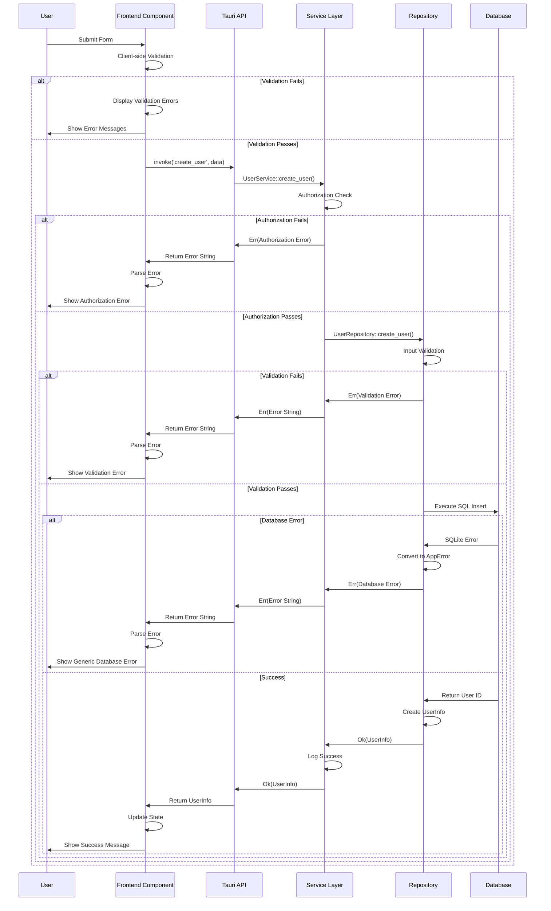

# Error Handling Strategy

This document defines the comprehensive error handling strategy for Ferrocodex, establishing consistent patterns across the Rust backend and TypeScript frontend to ensure robust error management and excellent user experience.

## Error Handling Philosophy

### Core Principles
- **Fail Fast, Recover Gracefully**: Detect errors early and provide meaningful recovery options
- **User-Centric Messaging**: All user-facing errors are clear, actionable, and non-technical
- **Complete Error Context**: Internal errors include full context for debugging
- **Security-First**: Never expose sensitive system information in error messages
- **Consistent Format**: Standardized error structures across all layers
- **Audit Trail**: All errors are logged for monitoring and analysis
- **Proactive Recovery**: Implement multiple recovery strategies for different error scenarios
- **Context Preservation**: Maintain full operational context throughout error propagation

### Error Categories

#### By Severity Level
1. **Critical**: System integrity threats, data corruption, security breaches
2. **High**: Authentication failures, authorization violations, data access issues
3. **Medium**: Business logic violations, validation errors, resource conflicts
4. **Low**: User input errors, temporary service unavailability, display issues

#### By Domain
1. **Authentication & Authorization**: Session management, permissions, rate limiting
2. **Data Management**: Database failures, validation errors, encryption issues
3. **Asset Operations**: Firmware handling, configuration management, vault operations
4. **System Integration**: File I/O, external services, network connectivity
5. **User Interface**: Input validation, display errors, component failures

#### By Recovery Strategy
1. **Auto-Recoverable**: Transient network issues, temporary resource constraints
2. **User-Recoverable**: Invalid input, authentication renewal, permission requests
3. **Admin-Recoverable**: System configuration, resource allocation, service restart
4. **Manual-Recoverable**: Data corruption, hardware failures, external dependencies

## Backend Error Handling (Rust)

### Enhanced Error System Architecture

#### Error Context Structure
```rust
// Enhanced error context for comprehensive tracking
#[derive(Debug, Clone, Serialize, Deserialize)]
pub struct ErrorContext {
    pub request_id: String,
    pub user_id: Option<String>,
    pub username: Option<String>,
    pub operation: String,
    pub component: String,
    pub timestamp: chrono::DateTime<chrono::Utc>,
    pub session_id: Option<String>,
    pub correlation_data: std::collections::HashMap<String, String>,
}

impl ErrorContext {
    pub fn new(operation: &str, component: &str) -> Self {
        Self {
            request_id: uuid::Uuid::new_v4().to_string(),
            user_id: None,
            username: None,
            operation: operation.to_string(),
            component: component.to_string(),
            timestamp: chrono::Utc::now(),
            session_id: None,
            correlation_data: std::collections::HashMap::new(),
        }
    }
    
    pub fn with_user(mut self, user_id: String, username: String) -> Self {
        self.user_id = Some(user_id);
        self.username = Some(username);
        self
    }
    
    pub fn with_session(mut self, session_id: String) -> Self {
        self.session_id = Some(session_id);
        self
    }
    
    pub fn add_correlation(mut self, key: &str, value: &str) -> Self {
        self.correlation_data.insert(key.to_string(), value.to_string());
        self
    }
}
```

#### Core Error Types
```rust
// Core error handling using Result<T, String> pattern
pub type AppResult<T> = Result<T, String>;

// Enhanced error categories with severity and context
#[derive(Debug, Clone, thiserror::Error, Serialize, Deserialize)]
pub enum AppError {
    #[error("Database operation failed: {message}")]
    Database { 
        message: String, 
        source: Option<String>, 
        context: ErrorContext,
        severity: ErrorSeverity,
        recovery_suggestion: Option<String>,
    },
    
    #[error("Authentication failed: {message}")]
    Authentication { 
        message: String, 
        context: ErrorContext,
        reason: AuthFailureReason,
        retry_after: Option<u64>,
    },
    
    #[error("Authorization failed: {message}")]
    Authorization { 
        message: String, 
        context: ErrorContext,
        required_role: Option<String>,
        current_role: Option<String>,
        resource: Option<String>,
    },
    
    #[error("Validation failed: {message}")]
    Validation { 
        message: String, 
        field: Option<String>, 
        context: ErrorContext,
        constraints: Vec<String>,
        provided_value: Option<String>,
    },
    
    #[error("Resource not found: {resource}")]
    NotFound { 
        resource: String, 
        context: ErrorContext,
        search_criteria: Option<String>,
        suggestions: Vec<String>,
    },
    
    #[error("Resource conflict: {message}")]
    Conflict { 
        message: String, 
        context: ErrorContext,
        conflicting_resource: Option<String>,
        resolution_options: Vec<String>,
    },
    
    #[error("Rate limit exceeded: {message}")]
    RateLimit { 
        message: String, 
        retry_after: Option<u64>, 
        context: ErrorContext,
        limit_type: String,
        current_usage: Option<u64>,
        limit_threshold: Option<u64>,
    },
    
    #[error("Internal server error: {message}")]
    Internal { 
        message: String, 
        source: Option<String>, 
        context: ErrorContext,
        severity: ErrorSeverity,
        recovery_action: Option<String>,
    },
    
    #[error("External service error: {service}: {message}")]
    ExternalService { 
        service: String, 
        message: String, 
        context: ErrorContext,
        service_status: Option<String>,
        fallback_available: bool,
    },
    
    #[error("File operation failed: {message}")]
    FileOperation { 
        message: String, 
        path: Option<String>, 
        context: ErrorContext,
        operation_type: String,
        permissions_issue: bool,
    },
    
    // New domain-specific errors
    #[error("Asset operation failed: {message}")]
    AssetOperation {
        message: String,
        asset_id: Option<String>,
        operation: String,
        context: ErrorContext,
        asset_state: Option<String>,
    },
    
    #[error("Vault operation failed: {message}")]
    VaultOperation {
        message: String,
        vault_path: Option<String>,
        operation: String,
        context: ErrorContext,
        encryption_issue: bool,
    },
    
    #[error("Configuration error: {message}")]
    Configuration {
        message: String,
        config_key: Option<String>,
        context: ErrorContext,
        expected_format: Option<String>,
        provided_value: Option<String>,
    },
}

// Supporting enums for enhanced error context
#[derive(Debug, Clone, Serialize, Deserialize)]
pub enum ErrorSeverity {
    Critical,    // System integrity at risk
    High,        // Major functionality impaired
    Medium,      // Minor functionality impaired
    Low,         // Cosmetic or easily recoverable
}

#[derive(Debug, Clone, Serialize, Deserialize)]
pub enum AuthFailureReason {
    InvalidCredentials,
    SessionExpired,
    SessionInvalidated,
    RateLimited,
    AccountLocked,
    AccountDisabled,
    MfaRequired,
    MfaFailed,
}

impl AppError {
    /// Convert to user-friendly message, hiding sensitive details
    pub fn user_message(&self) -> String {
        match self {
            AppError::Database { .. } => "A database error occurred. Please try again.".to_string(),
            AppError::Authentication { message } => message.clone(),
            AppError::Authorization { message } => message.clone(),
            AppError::Validation { message, .. } => message.clone(),
            AppError::NotFound { resource } => format!("{} not found", resource),
            AppError::Conflict { message } => message.clone(),
            AppError::RateLimit { message, .. } => message.clone(),
            AppError::Internal { .. } => "An internal error occurred. Please try again.".to_string(),
            AppError::ExternalService { .. } => "External service unavailable. Please try again later.".to_string(),
            AppError::FileOperation { message, .. } => message.clone(),
        }
    }
    
    /// Get error code for client-side handling
    pub fn error_code(&self) -> &'static str {
        match self {
            AppError::Database { .. } => "DATABASE_ERROR",
            AppError::Authentication { .. } => "AUTHENTICATION_ERROR",
            AppError::Authorization { .. } => "AUTHORIZATION_ERROR",
            AppError::Validation { .. } => "VALIDATION_ERROR",
            AppError::NotFound { .. } => "NOT_FOUND",
            AppError::Conflict { .. } => "CONFLICT",
            AppError::RateLimit { .. } => "RATE_LIMIT",
            AppError::Internal { .. } => "INTERNAL_ERROR",
            AppError::ExternalService { .. } => "EXTERNAL_SERVICE_ERROR",
            AppError::FileOperation { .. } => "FILE_OPERATION_ERROR",
        }
    }
}

// Convert AppError to String for Tauri commands
impl From<AppError> for String {
    fn from(error: AppError) -> Self {
        error.user_message()
    }
}
```

### Error Handling Patterns

#### Repository Layer
```rust
// Database operations with comprehensive error handling
#[async_trait::async_trait]
impl UserRepository for SqliteUserRepository {
    async fn create_user(&self, request: CreateUserRequest) -> Result<UserInfo, String> {
        // Input validation
        validate_user_request(&request)?;
        
        // Check for existing user
        if let Ok(Some(_)) = self.get_user_by_username(&request.username).await {
            return Err(AppError::Conflict {
                message: "Username already exists".to_string(),
            }.into());
        }
        
        // Hash password
        let password_hash = hash_password(&request.password)
            .map_err(|e| AppError::Internal {
                message: "Password hashing failed".to_string(),
                source: Some(e.to_string()),
            })?;
        
        // Database operation with transaction
        let mut transaction = self.db.begin_transaction().await
            .map_err(|e| AppError::Database {
                message: "Failed to begin transaction".to_string(),
                source: Some(e.to_string()),
            })?;
        
        let user_id = match transaction.execute(
            "INSERT INTO users (username, password_hash, role, created_at, is_active) 
             VALUES (?1, ?2, ?3, ?4, ?5)",
            params![
                &request.username,
                &password_hash,
                &request.role.to_string(),
                &chrono::Utc::now().to_rfc3339(),
                &true,
            ],
        ).await {
            Ok(id) => id,
            Err(e) => {
                transaction.rollback().await.ok();
                return Err(AppError::Database {
                    message: "Failed to create user".to_string(),
                    source: Some(e.to_string()),
                }.into());
            }
        };
        
        // Commit transaction
        transaction.commit().await
            .map_err(|e| AppError::Database {
                message: "Failed to commit transaction".to_string(),
                source: Some(e.to_string()),
            })?;
        
        // Create audit log entry
        if let Err(e) = self.audit_repo.log_user_created(user_id, &request.username).await {
            warn!("Failed to create audit log: {}", e);
            // Don't fail the operation for audit logging failures
        }
        
        // Return success
        let user_info = UserInfo {
            id: user_id,
            username: request.username,
            role: request.role,
            created_at: chrono::Utc::now().to_rfc3339(),
            is_active: true,
        };
        
        info!("User created successfully: {} (ID: {})", user_info.username, user_info.id);
        Ok(user_info)
    }
}
```

#### Service Layer
```rust
// Business logic layer with error composition
pub struct UserService {
    user_repo: Arc<dyn UserRepository>,
    audit_repo: Arc<dyn AuditRepository>,
    rate_limiter: Arc<Mutex<RateLimiter>>,
}

impl UserService {
    pub async fn create_user(
        &self,
        request: CreateUserRequest,
        current_user: &UserInfo,
    ) -> Result<UserInfo, String> {
        // Authorization check
        if current_user.role != UserRole::Administrator {
            return Err(AppError::Authorization {
                message: "Administrator role required to create users".to_string(),
            }.into());
        }
        
        // Rate limiting check
        {
            let mut limiter = self.rate_limiter.lock().unwrap();
            limiter.check_rate_limit(&current_user.username, "user_creation")
                .map_err(|_| AppError::RateLimit {
                    message: "Too many user creation attempts. Please wait before trying again.".to_string(),
                    retry_after: Some(300), // 5 minutes
                })?;
        }
        
        // Delegate to repository with error context
        let result = self.user_repo.create_user(request.clone()).await
            .map_err(|e| {
                error!("User creation failed for {}: {}", request.username, e);
                e
            })?;
        
        // Log successful operation
        info!("User {} created by {}", result.username, current_user.username);
        
        Ok(result)
    }
}
```

#### Tauri Commands
```rust
// Tauri command with comprehensive error handling
#[tauri::command]
pub async fn create_user(
    app: AppHandle,
    db_state: State<'_, DatabaseState>,
    session_state: State<'_, SessionManagerState>,
    user_data: CreateUserRequest,
) -> Result<UserInfo, String> {
    // Session validation with detailed error context
    let session_manager = session_state.lock().unwrap();
    let current_user = session_manager
        .get_current_user()
        .ok_or_else(|| AppError::Authentication {
            message: "Valid session required".to_string(),
        })?;
    
    // Database access with error handling
    let db = db_state
        .lock()
        .unwrap()
        .as_ref()
        .ok_or_else(|| AppError::Internal {
            message: "Database not initialized".to_string(),
            source: None,
        })?;
    
    // Initialize services
    let user_repo = Arc::new(SqliteUserRepository::new(db.clone()));
    let audit_repo = Arc::new(SqliteAuditRepository::new(db.clone()));
    let rate_limiter = app.state::<Arc<Mutex<RateLimiter>>>();
    
    let user_service = UserService {
        user_repo,
        audit_repo,
        rate_limiter: rate_limiter.clone(),
    };
    
    // Execute operation with full error context
    match user_service.create_user(user_data, &current_user).await {
        Ok(user) => {
            info!("User creation successful: {}", user.username);
            Ok(user)
        }
        Err(e) => {
            error!("User creation failed: {}", e);
            Err(e)
        }
    }
}
```

### Input Validation
```rust
// Comprehensive input validation with detailed error messages
pub fn validate_user_request(request: &CreateUserRequest) -> Result<(), String> {
    let mut errors = Vec::new();
    
    // Username validation
    if let Err(e) = validate_username(&request.username) {
        errors.push(format!("Username: {}", e));
    }
    
    // Password validation
    if let Err(e) = validate_password(&request.password) {
        errors.push(format!("Password: {}", e));
    }
    
    // Role validation
    if !matches!(request.role, UserRole::Administrator | UserRole::Engineer) {
        errors.push("Role: Invalid role specified".to_string());
    }
    
    if errors.is_empty() {
        Ok(())
    } else {
        Err(AppError::Validation {
            message: errors.join("; "),
            field: None,
        }.into())
    }
}

fn validate_username(username: &str) -> Result<(), String> {
    let trimmed = username.trim();
    
    if trimmed.is_empty() {
        return Err("Username cannot be empty".to_string());
    }
    
    if trimmed.len() < 3 {
        return Err("Username must be at least 3 characters long".to_string());
    }
    
    if trimmed.len() > 50 {
        return Err("Username cannot exceed 50 characters".to_string());
    }
    
    if !trimmed.chars().all(|c| c.is_alphanumeric() || c == '_' || c == '-') {
        return Err("Username can only contain letters, numbers, underscores, and hyphens".to_string());
    }
    
    if trimmed.starts_with('_') || trimmed.starts_with('-') {
        return Err("Username cannot start with underscore or hyphen".to_string());
    }
    
    Ok(())
}

fn validate_password(password: &str) -> Result<(), String> {
    if password.len() < 8 {
        return Err("Password must be at least 8 characters long".to_string());
    }
    
    if password.len() > 128 {
        return Err("Password cannot exceed 128 characters".to_string());
    }
    
    let has_lowercase = password.chars().any(|c| c.is_lowercase());
    let has_uppercase = password.chars().any(|c| c.is_uppercase());
    let has_digit = password.chars().any(|c| c.is_numeric());
    let has_special = password.chars().any(|c| "!@#$%^&*()_+-=[]{}|;:,.<>?".contains(c));
    
    if !has_lowercase {
        return Err("Password must contain at least one lowercase letter".to_string());
    }
    
    if !has_uppercase {
        return Err("Password must contain at least one uppercase letter".to_string());
    }
    
    if !has_digit {
        return Err("Password must contain at least one number".to_string());
    }
    
    if !has_special {
        return Err("Password must contain at least one special character".to_string());
    }
    
    Ok(())
}
```

## Enhanced Frontend Error Handling (TypeScript)

### Enhanced Error Context Management

#### Frontend Error Context
```typescript
// Enhanced frontend error context matching backend structure
export interface FrontendErrorContext {
  requestId: string;
  userId?: string;
  username?: string;
  operation: string;
  component: string;
  timestamp: string;
  sessionId?: string;
  correlationData: Record<string, string>;
  userAgent: string;
  url: string;
}

// Enhanced error recovery metadata
export interface ErrorRecoveryMetadata {
  isRetryable: boolean;
  maxRetries: number;
  retryDelay?: number;
  fallbackAvailable: boolean;
  userActionRequired: boolean;
  suggestedActions: string[];
  recoveryInstructions?: string;
}
```

### Enhanced Error Type Definitions
```typescript
// Frontend error types matching backend structure
export interface AppError {
  code: string;
  message: string;
  details?: Record<string, unknown>;
  timestamp: string;
}

export interface ValidationError extends AppError {
  code: 'VALIDATION_ERROR';
  field?: string;
  details: {
    field?: string;
    value?: string;
    constraint?: string;
  };
}

export interface AuthenticationError extends AppError {
  code: 'AUTHENTICATION_ERROR';
  details: {
    reason?: 'invalid_credentials' | 'session_expired' | 'rate_limited';
    retry_after?: number;
  };
}

export interface AuthorizationError extends AppError {
  code: 'AUTHORIZATION_ERROR';
  details: {
    required_role?: string;
    current_role?: string;
    resource?: string;
  };
}

// Generic error response from backend
export interface ErrorResponse {
  success: false;
  error: AppError;
}

// Success response wrapper
export interface SuccessResponse<T> {
  success: true;
  data: T;
}

export type ApiResponse<T> = SuccessResponse<T> | ErrorResponse;
```

### Error Handling Service
```typescript
// Centralized error handling service
class ErrorHandlingService {
  private notificationApi: NotificationApi;
  
  constructor() {
    // Will be set by the main app component
    this.notificationApi = notification;
  }
  
  setNotificationApi(api: NotificationApi) {
    this.notificationApi = api;
  }
  
  /**
   * Handle errors from Tauri API calls
   */
  handleTauriError(error: unknown, context?: string): AppError {
    const timestamp = new Date().toISOString();
    
    if (typeof error === 'string') {
      // Simple string error from backend
      return {
        code: 'UNKNOWN_ERROR',
        message: error,
        timestamp,
      };
    }
    
    if (error instanceof Error) {
      // JavaScript Error object
      return {
        code: 'CLIENT_ERROR',
        message: error.message,
        details: {
          stack: error.stack,
          context,
        },
        timestamp,
      };
    }
    
    // Unknown error type
    return {
      code: 'UNKNOWN_ERROR',
      message: 'An unexpected error occurred',
      details: { error: String(error), context },
      timestamp,
    };
  }
  
  /**
   * Display error notification to user
   */
  showError(error: AppError, customMessage?: string) {
    const message = customMessage || this.getUserFriendlyMessage(error);
    
    // Log error for debugging
    console.error('Application error:', {
      ...error,
      userMessage: message,
    });
    
    // Show notification to user
    this.notificationApi.error({
      message: 'Error',
      description: message,
      duration: error.code === 'RATE_LIMIT' ? 10 : 5,
      placement: 'topRight',
    });
  }
  
  /**
   * Convert error to user-friendly message
   */
  private getUserFriendlyMessage(error: AppError): string {
    switch (error.code) {
      case 'AUTHENTICATION_ERROR':
        return 'Please check your credentials and try again.';
      case 'AUTHORIZATION_ERROR':
        return 'You do not have permission to perform this action.';
      case 'VALIDATION_ERROR':
        return error.message; // Validation errors are already user-friendly
      case 'NOT_FOUND':
        return error.message;
      case 'CONFLICT':
        return error.message;
      case 'RATE_LIMIT':
        return 'Too many requests. Please wait before trying again.';
      case 'DATABASE_ERROR':
        return 'A database error occurred. Please try again.';
      case 'EXTERNAL_SERVICE_ERROR':
        return 'External service unavailable. Please try again later.';
      case 'FILE_OPERATION_ERROR':
        return error.message;
      default:
        return 'An unexpected error occurred. Please try again.';
    }
  }
  
  /**
   * Handle form validation errors
   */
  handleValidationErrors(errors: ValidationError[]): Record<string, string> {
    const fieldErrors: Record<string, string> = {};
    
    errors.forEach(error => {
      const field = error.field || error.details?.field || 'general';
      fieldErrors[field] = error.message;
    });
    
    return fieldErrors;
  }
  
  /**
   * Check if error is retryable
   */
  isRetryableError(error: AppError): boolean {
    const retryableCodes = [
      'DATABASE_ERROR',
      'EXTERNAL_SERVICE_ERROR',
      'INTERNAL_ERROR',
    ];
    
    return retryableCodes.includes(error.code);
  }
  
  /**
   * Get retry delay for rate limited requests
   */
  getRetryDelay(error: AppError): number | null {
    if (error.code === 'RATE_LIMIT' && error.details?.retry_after) {
      return Number(error.details.retry_after) * 1000; // Convert to milliseconds
    }
    
    return null;
  }
}

export const errorHandler = new ErrorHandlingService();
```

### Component Error Handling Patterns
```typescript
// Hook for handling async operations with error management
export function useAsyncOperation<T, P extends unknown[]>(
  operation: (...args: P) => Promise<T>,
  options?: {
    onSuccess?: (data: T) => void;
    onError?: (error: AppError) => void;
    showSuccessNotification?: boolean;
    successMessage?: string;
  }
) {
  const [loading, setLoading] = useState(false);
  const [error, setError] = useState<AppError | null>(null);
  const [data, setData] = useState<T | null>(null);
  
  const execute = useCallback(async (...args: P): Promise<T | null> => {
    setLoading(true);
    setError(null);
    
    try {
      const result = await operation(...args);
      setData(result);
      
      if (options?.onSuccess) {
        options.onSuccess(result);
      }
      
      if (options?.showSuccessNotification) {
        notification.success({
          message: 'Success',
          description: options.successMessage || 'Operation completed successfully',
        });
      }
      
      return result;
      
    } catch (err) {
      const appError = errorHandler.handleTauriError(err, operation.name);
      setError(appError);
      
      if (options?.onError) {
        options.onError(appError);
      } else {
        errorHandler.showError(appError);
      }
      
      return null;
      
    } finally {
      setLoading(false);
    }
  }, [operation, options]);
  
  const reset = useCallback(() => {
    setLoading(false);
    setError(null);
    setData(null);
  }, []);
  
  return {
    loading,
    error,
    data,
    execute,
    reset,
    isRetryable: error ? errorHandler.isRetryableError(error) : false,
  };
}

// Example component using the async operation hook
const UserManagement: React.FC = () => {
  const [users, setUsers] = useState<UserInfo[]>([]);
  const [formError, setFormError] = useState<string | null>(null);
  
  // Load users with error handling
  const {
    loading: loadingUsers,
    error: loadError,
    execute: loadUsers,
    isRetryable: canRetryLoad,
  } = useAsyncOperation(
    async () => {
      const result = await invoke<UserInfo[]>('get_users');
      return result;
    },
    {
      onSuccess: (data) => setUsers(data),
    }
  );
  
  // Create user with error handling
  const {
    loading: creatingUser,
    execute: createUser,
  } = useAsyncOperation(
    async (userData: CreateUserRequest) => {
      const result = await invoke<UserInfo>('create_user', { userData });
      return result;
    },
    {
      onSuccess: (newUser) => {
        setUsers(prev => [...prev, newUser]);
        form.resetFields();
      },
      showSuccessNotification: true,
      successMessage: 'User created successfully',
    }
  );
  
  // Form submission with validation error handling
  const handleSubmit = async (values: CreateUserRequest) => {
    setFormError(null);
    
    try {
      await createUser(values);
    } catch (err) {
      // Error is already handled by useAsyncOperation
      // Just set form-specific error state if needed
      const error = errorHandler.handleTauriError(err);
      if (error.code === 'VALIDATION_ERROR') {
        setFormError(error.message);
      }
    }
  };
  
  // Load users on component mount
  useEffect(() => {
    loadUsers();
  }, [loadUsers]);
  
  return (
    <div>
      {/* Error display with retry option */}
      {loadError && (
        <Alert
          type="error"
          message="Failed to load users"
          description={loadError.message}
          action={
            canRetryLoad && (
              <Button size="small" onClick={() => loadUsers()}>
                Retry
              </Button>
            )
          }
          closable
        />
      )}
      
      {/* Form with error handling */}
      <Form onFinish={handleSubmit}>
        {formError && (
          <Alert
            type="error"
            message={formError}
            style={{ marginBottom: 16 }}
            closable
            onClose={() => setFormError(null)}
          />
        )}
        
        <Form.Item
          name="username"
          label="Username"
          rules={[
            { required: true, message: 'Username is required' },
            { min: 3, message: 'Username must be at least 3 characters' },
            { max: 50, message: 'Username cannot exceed 50 characters' },
            {
              pattern: /^[a-zA-Z0-9_-]+$/,
              message: 'Username can only contain letters, numbers, underscores, and hyphens',
            },
          ]}
        >
          <Input placeholder="Enter username" />
        </Form.Item>
        
        <Form.Item>
          <Button
            type="primary"
            htmlType="submit"
            loading={creatingUser}
          >
            Create User
          </Button>
        </Form.Item>
      </Form>
      
      {/* Users table */}
      <Table
        dataSource={users}
        loading={loadingUsers}
        rowKey="id"
        // ... table configuration
      />
    </div>
  );
};
```

### Global Error Boundary
```typescript
// Global error boundary for unhandled errors
interface ErrorBoundaryState {
  hasError: boolean;
  error?: Error;
  errorInfo?: ErrorInfo;
}

class GlobalErrorBoundary extends Component<
  { children: ReactNode },
  ErrorBoundaryState
> {
  constructor(props: { children: ReactNode }) {
    super(props);
    this.state = { hasError: false };
  }
  
  static getDerivedStateFromError(error: Error): ErrorBoundaryState {
    return {
      hasError: true,
      error,
    };
  }
  
  componentDidCatch(error: Error, errorInfo: ErrorInfo) {
    // Log error to console and any external service
    console.error('Unhandled error caught by boundary:', error, errorInfo);
    
    // Report to error tracking service if available
    if (window.electronAPI?.reportError) {
      window.electronAPI.reportError({
        error: error.message,
        stack: error.stack,
        componentStack: errorInfo.componentStack,
        timestamp: new Date().toISOString(),
      });
    }
    
    this.setState({
      error,
      errorInfo,
    });
  }
  
  render() {
    if (this.state.hasError) {
      return (
        <div style={{ padding: '20px', textAlign: 'center' }}>
          <Result
            status="error"
            title="Something went wrong"
            subTitle="An unexpected error occurred. Please refresh the page or restart the application."
            extra={[
              <Button
                type="primary"
                key="refresh"
                onClick={() => window.location.reload()}
              >
                Refresh Page
              </Button>,
              <Button
                key="restart"
                onClick={() => {
                  if (window.electronAPI?.restart) {
                    window.electronAPI.restart();
                  }
                }}
              >
                Restart Application
              </Button>,
            ]}
          />
          
          {process.env.NODE_ENV === 'development' && (
            <details style={{ marginTop: '20px', textAlign: 'left' }}>
              <summary>Error Details (Development Only)</summary>
              <pre style={{ whiteSpace: 'pre-wrap' }}>
                {this.state.error?.stack}
                {this.state.errorInfo?.componentStack}
              </pre>
            </details>
          )}
        </div>
      );
    }
    
    return this.props.children;
  }
}
```

## Error Flow Sequence Diagram



## Error Logging and Monitoring

### Backend Logging
```rust
use tracing::{error, warn, info, debug, instrument};

// Structured logging with error context
#[instrument(skip(db, request), fields(username = %request.username))]
pub async fn create_user(
    db: &Database,
    request: CreateUserRequest,
) -> Result<UserInfo, String> {
    info!("Creating user: {}", request.username);
    
    match validate_user_request(&request) {
        Ok(_) => debug!("User request validation passed"),
        Err(e) => {
            warn!("User request validation failed: {}", e);
            return Err(e);
        }
    }
    
    // ... implementation
    
    match result {
        Ok(user) => {
            info!("User created successfully: {} (ID: {})", user.username, user.id);
            Ok(user)
        }
        Err(e) => {
            error!("User creation failed: {}", e);
            Err(e.into())
        }
    }
}
```

### Frontend Logging
```typescript
// Structured error logging
class ErrorLogger {
  static logError(error: AppError, context?: string) {
    const logEntry = {
      timestamp: new Date().toISOString(),
      level: 'error',
      code: error.code,
      message: error.message,
      context,
      details: error.details,
      userAgent: navigator.userAgent,
      url: window.location.href,
    };
    
    console.error('Application Error:', logEntry);
    
    // Send to backend for aggregation (optional)
    if (context !== 'logging') { // Prevent infinite loops
      invoke('log_frontend_error', { logEntry }).catch(err => {
        console.error('Failed to log error to backend:', err);
      });
    }
  }
  
  static logWarning(message: string, details?: Record<string, unknown>) {
    const logEntry = {
      timestamp: new Date().toISOString(),
      level: 'warning',
      message,
      details,
    };
    
    console.warn('Application Warning:', logEntry);
  }
}
```

## Enhanced Error Recovery Strategies

### Multi-Level Recovery Architecture

#### 1. Immediate Automatic Recovery
```rust
// Enhanced retry mechanism with context awareness
#[derive(Debug, Clone)]
pub struct RecoveryStrategy {
    pub max_attempts: u32,
    pub base_delay_ms: u64,
    pub max_delay_ms: u64,
    pub backoff_multiplier: f64,
    pub circuit_breaker_threshold: u32,
    pub recovery_actions: Vec<RecoveryAction>,
}

#[derive(Debug, Clone)]
pub enum RecoveryAction {
    Retry,
    RetryWithDelay(u64),
    Fallback(String),
    Escalate,
    UserIntervention(String),
    SystemRestart,
    CacheRefresh,
    ReAuthenticate,
}

impl AppError {
    pub fn get_recovery_strategy(&self) -> RecoveryStrategy {
        match self {
            AppError::Database { severity, .. } => match severity {
                ErrorSeverity::Critical => RecoveryStrategy {
                    max_attempts: 1,
                    base_delay_ms: 0,
                    max_delay_ms: 0,
                    backoff_multiplier: 1.0,
                    circuit_breaker_threshold: 1,
                    recovery_actions: vec![RecoveryAction::Escalate, RecoveryAction::SystemRestart],
                },
                _ => RecoveryStrategy {
                    max_attempts: 3,
                    base_delay_ms: 1000,
                    max_delay_ms: 30000,
                    backoff_multiplier: 2.0,
                    circuit_breaker_threshold: 5,
                    recovery_actions: vec![
                        RecoveryAction::Retry,
                        RecoveryAction::RetryWithDelay(5000),
                        RecoveryAction::Fallback("cached_data".to_string()),
                    ],
                },
            },
            AppError::Authentication { reason, .. } => match reason {
                AuthFailureReason::SessionExpired => RecoveryStrategy {
                    max_attempts: 1,
                    base_delay_ms: 0,
                    max_delay_ms: 0,
                    backoff_multiplier: 1.0,
                    circuit_breaker_threshold: 1,
                    recovery_actions: vec![RecoveryAction::ReAuthenticate],
                },
                AuthFailureReason::RateLimited => RecoveryStrategy {
                    max_attempts: 3,
                    base_delay_ms: 30000,
                    max_delay_ms: 300000,
                    backoff_multiplier: 2.0,
                    circuit_breaker_threshold: 3,
                    recovery_actions: vec![
                        RecoveryAction::RetryWithDelay(30000),
                        RecoveryAction::UserIntervention("Rate limited. Please wait before trying again.".to_string()),
                    ],
                },
                _ => RecoveryStrategy {
                    max_attempts: 1,
                    base_delay_ms: 0,
                    max_delay_ms: 0,
                    backoff_multiplier: 1.0,
                    circuit_breaker_threshold: 1,
                    recovery_actions: vec![RecoveryAction::UserIntervention("Please check your credentials.".to_string())],
                },
            },
            AppError::ExternalService { fallback_available, .. } => {
                if *fallback_available {
                    RecoveryStrategy {
                        max_attempts: 2,
                        base_delay_ms: 2000,
                        max_delay_ms: 10000,
                        backoff_multiplier: 2.0,
                        circuit_breaker_threshold: 3,
                        recovery_actions: vec![
                            RecoveryAction::Retry,
                            RecoveryAction::Fallback("local_cache".to_string()),
                        ],
                    }
                } else {
                    RecoveryStrategy {
                        max_attempts: 3,
                        base_delay_ms: 5000,
                        max_delay_ms: 60000,
                        backoff_multiplier: 2.0,
                        circuit_breaker_threshold: 5,
                        recovery_actions: vec![
                            RecoveryAction::RetryWithDelay(5000),
                            RecoveryAction::UserIntervention("External service unavailable. Please try again later.".to_string()),
                        ],
                    }
                }
            },
            _ => RecoveryStrategy {
                max_attempts: 1,
                base_delay_ms: 0,
                max_delay_ms: 0,
                backoff_multiplier: 1.0,
                circuit_breaker_threshold: 1,
                recovery_actions: vec![RecoveryAction::UserIntervention("An error occurred. Please try again.".to_string())],
            },
        }
    }
}
```

#### 2. Graceful Degradation Patterns
```rust
// Service degradation manager
pub struct ServiceDegradationManager {
    degraded_services: Arc<Mutex<HashSet<String>>>,
    fallback_providers: HashMap<String, Box<dyn FallbackProvider>>,
}

pub trait FallbackProvider: Send + Sync {
    fn can_provide_fallback(&self, service: &str) -> bool;
    fn provide_fallback(&self, service: &str, context: &ErrorContext) -> Result<serde_json::Value, String>;
}

impl ServiceDegradationManager {
    pub fn handle_service_failure(&self, service: &str, error: &AppError) -> RecoveryDecision {
        let mut degraded = self.degraded_services.lock().unwrap();
        degraded.insert(service.to_string());
        
        if let Some(fallback) = self.fallback_providers.get(service) {
            if fallback.can_provide_fallback(service) {
                return RecoveryDecision::UseFallback(service.to_string());
            }
        }
        
        match error {
            AppError::Database { severity: ErrorSeverity::Critical, .. } => {
                RecoveryDecision::SystemShutdown("Critical database failure".to_string())
            },
            AppError::ExternalService { .. } => {
                RecoveryDecision::DisableFeature(service.to_string())
            },
            _ => RecoveryDecision::RetryLater(service.to_string()),
        }
    }
}

#[derive(Debug)]
pub enum RecoveryDecision {
    UseFallback(String),
    DisableFeature(String),
    RetryLater(String),
    SystemShutdown(String),
    UserNotification(String),
}
```

#### 3. Context-Aware Recovery
```rust
// Recovery context manager
pub struct RecoveryContextManager {
    active_recoveries: Arc<Mutex<HashMap<String, RecoveryAttempt>>>,
    user_preferences: Arc<Mutex<HashMap<String, UserRecoveryPreferences>>>,
}

#[derive(Debug, Clone)]
pub struct RecoveryAttempt {
    pub request_id: String,
    pub error_type: String,
    pub attempt_count: u32,
    pub last_attempt: chrono::DateTime<chrono::Utc>,
    pub next_attempt: Option<chrono::DateTime<chrono::Utc>>,
    pub recovery_strategy: RecoveryStrategy,
    pub user_notified: bool,
}

#[derive(Debug, Clone)]
pub struct UserRecoveryPreferences {
    pub auto_retry_enabled: bool,
    pub max_auto_retries: u32,
    pub notification_threshold: u32,
    pub preferred_recovery_actions: Vec<RecoveryAction>,
}

impl RecoveryContextManager {
    pub fn should_attempt_recovery(&self, error: &AppError) -> bool {
        let context = match error {
            AppError::Database { context, .. } => context,
            AppError::Authentication { context, .. } => context,
            // ... other error types
            _ => return false,
        };
        
        let mut active = self.active_recoveries.lock().unwrap();
        
        if let Some(attempt) = active.get_mut(&context.request_id) {
            attempt.attempt_count < attempt.recovery_strategy.max_attempts
        } else {
            true
        }
    }
    
    pub fn record_recovery_attempt(&self, error: &AppError, success: bool) {
        // Implementation for tracking recovery attempts
    }
}
```

### Automatic Retry
```typescript
// Exponential backoff retry logic
class RetryHandler {
  static async withRetry<T>(
    operation: () => Promise<T>,
    options: {
      maxRetries?: number;
      baseDelay?: number;
      maxDelay?: number;
      retryCondition?: (error: AppError) => boolean;
    } = {}
  ): Promise<T> {
    const {
      maxRetries = 3,
      baseDelay = 1000,
      maxDelay = 30000,
      retryCondition = (error) => errorHandler.isRetryableError(error),
    } = options;
    
    let lastError: AppError;
    
    for (let attempt = 0; attempt <= maxRetries; attempt++) {
      try {
        return await operation();
      } catch (err) {
        lastError = errorHandler.handleTauriError(err);
        
        if (attempt === maxRetries || !retryCondition(lastError)) {
          throw lastError;
        }
        
        const delay = Math.min(
          baseDelay * Math.pow(2, attempt),
          maxDelay
        );
        
        console.warn(`Operation failed (attempt ${attempt + 1}/${maxRetries + 1}), retrying in ${delay}ms:`, lastError);
        
        await new Promise(resolve => setTimeout(resolve, delay));
      }
    }
    
    throw lastError!;
  }
}
```

### Circuit Breaker Pattern
```rust
// Circuit breaker for external services
#[derive(Debug)]
pub struct CircuitBreaker {
    failure_count: Arc<Mutex<u32>>,
    last_failure_time: Arc<Mutex<Option<Instant>>>,
    threshold: u32,
    timeout: Duration,
    recovery_timeout: Duration,
}

impl CircuitBreaker {
    pub fn new(threshold: u32, timeout: Duration, recovery_timeout: Duration) -> Self {
        Self {
            failure_count: Arc::new(Mutex::new(0)),
            last_failure_time: Arc::new(Mutex::new(None)),
            threshold,
            timeout,
            recovery_timeout,
        }
    }
    
    pub async fn call<T, F, Fut>(&self, operation: F) -> Result<T, String>
    where
        F: FnOnce() -> Fut,
        Fut: Future<Output = Result<T, String>>,
    {
        // Check if circuit is open
        if self.is_open() {
            return Err(AppError::ExternalService {
                service: "circuit_breaker".to_string(),
                message: "Circuit breaker is open".to_string(),
            }.into());
        }
        
        match operation().await {
            Ok(result) => {
                self.on_success();
                Ok(result)
            }
            Err(e) => {
                self.on_failure();
                Err(e)
            }
        }
    }
    
    fn is_open(&self) -> bool {
        let failure_count = *self.failure_count.lock().unwrap();
        
        if failure_count >= self.threshold {
            let last_failure = *self.last_failure_time.lock().unwrap();
            
            if let Some(last_failure) = last_failure {
                Instant::now().duration_since(last_failure) < self.recovery_timeout
            } else {
                true
            }
        } else {
            false
        }
    }
    
    fn on_success(&self) {
        *self.failure_count.lock().unwrap() = 0;
        *self.last_failure_time.lock().unwrap() = None;
    }
    
    fn on_failure(&self) {
        *self.failure_count.lock().unwrap() += 1;
        *self.last_failure_time.lock().unwrap() = Some(Instant::now());
    }
}
```

## Enhanced Error Handling Architecture Summary

### Key Improvements for Issue #55

#### 1. Error System Architecture Enhancements
- **Structured Error Context**: Every error now carries comprehensive context including request ID, user information, operation details, and correlation data
- **Severity-Based Classification**: Critical, High, Medium, and Low severity levels for proper escalation
- **Domain-Specific Errors**: New error types for Asset Operations, Vault Operations, and Configuration management
- **Recovery Metadata**: Each error includes specific recovery suggestions and fallback options

#### 2. Enhanced Error Type Hierarchy
- **Multi-Dimensional Classification**: Errors classified by severity, domain, and recovery strategy
- **Rich Context Propagation**: Error context flows seamlessly from frontend through backend to database
- **Backward Compatibility**: All enhancements maintain compatibility with existing `Result<T, String>` pattern
- **Type Safety**: Strong typing ensures compile-time error handling verification

#### 3. Context Propagation Strategy
- **Request Tracing**: Unique request IDs enable end-to-end operation tracking
- **Cross-Layer Context**: User context, session information, and operation metadata preserved across all layers
- **Correlation Data**: Custom key-value pairs for additional context specific to each operation
- **Audit Integration**: All error context automatically flows to audit logging system

#### 4. Advanced Recovery Mechanisms
- **Multi-Level Recovery**: Immediate automatic retry, graceful degradation, user-guided recovery
- **Context-Aware Strategies**: Recovery decisions based on error type, severity, user preferences, and system state
- **Circuit Breaker Integration**: Automatic service isolation and fallback activation
- **User Preference Support**: Configurable recovery behaviors per user

#### 5. Implementation Benefits
- **Improved Debugging**: Rich error context enables faster issue resolution
- **Better User Experience**: Context-aware recovery provides clearer guidance to users
- **Enhanced Monitoring**: Comprehensive error telemetry for proactive system management
- **Reduced Downtime**: Automatic recovery mechanisms minimize service interruptions
- **Security Compliance**: Detailed audit trails for all error conditions

### Migration Path
1. **Phase 1**: Implement enhanced error types while maintaining backward compatibility
2. **Phase 2**: Add error context to existing operations gradually
3. **Phase 3**: Implement recovery strategies for critical operations
4. **Phase 4**: Roll out advanced recovery mechanisms across all features

This comprehensive error handling strategy ensures robust error management across all layers of the Ferrocodex application, providing excellent user experience while maintaining detailed error context for debugging and monitoring. The enhanced architecture addresses the specific requirements of issue #55 while building a foundation for future reliability improvements.